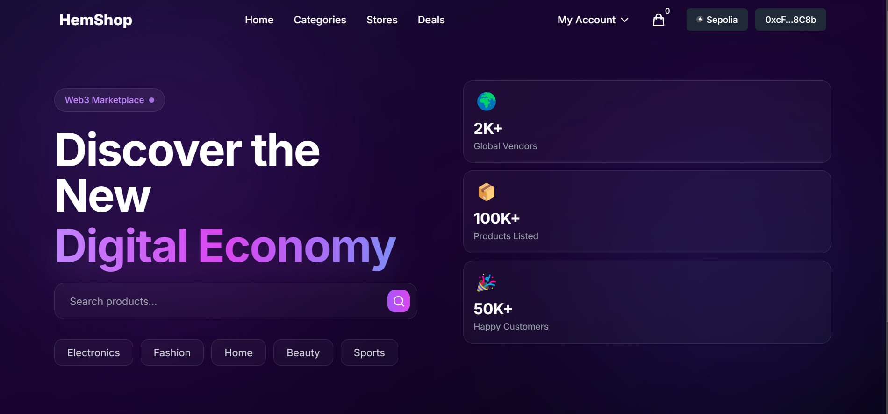

# HemShop - Decentralized E-commerce Platform

HemShop is a cutting-edge Web3-powered e-commerce platform that revolutionizes global commerce by enabling transactions using cryptocurrency payments. Built with the latest technologies like Next.js, TypeScript, and Ethereum smart contracts, HemShop offers a secure, decentralized marketplace for buying and selling products, ensuring transparency and trust in every transaction.



## 🌟 Key Features

- **Decentralized Marketplace**: Leveraging Ethereum smart contracts, HemShop provides a trustless environment where buyers and sellers can interact directly without intermediaries.
  
- **Crypto Payments**: Seamlessly buy and sell products using various cryptocurrencies, offering a modern payment solution that transcends traditional banking systems.

- **Global Access**: Connect with vendors from around the world, breaking geographical barriers and expanding your market reach.

- **Product Management**: Comprehensive tools for creating, updating, and managing product listings, ensuring sellers can efficiently handle their inventory.

- **Review System**: A robust product review and rating system that allows customers to share their experiences, helping others make informed purchasing decisions.

- **NFT Integration**: Utilize NFTs for product authenticity verification, ensuring that buyers receive genuine products.

- **Secure Authentication**: Implement Web3 authentication using Rainbow Kit and SIWE, providing a secure login experience for users.

- **Category Management**: Organize products into categories and subcategories, making it easier for customers to find what they need.

- **Seller Management**: Register and verify sellers, manage their status, and ensure compliance with platform standards.

- **Order Management**: Track and manage orders and deliveries, providing a seamless experience from purchase to delivery.

- **Service Fee Management**: Configure platform-wide service fees, ensuring sustainable operations and revenue generation.

## 🛠 Tech Stack

- **Frontend**:
  - **Next.js 13**: A powerful React framework for building fast, scalable web applications.
  - **TypeScript**: A statically typed language that enhances JavaScript, providing better tooling and error checking.
  - **Tailwind CSS**: A utility-first CSS framework for rapid UI development.
  - **Framer Motion**: A library for creating smooth animations and interactions.
  - **Rainbow Kit**: A toolkit for integrating Web3 authentication.
  - **React-Toastify**: A library for displaying notifications in a React application.

- **Blockchain**:
  - **Solidity**: The programming language for writing Ethereum smart contracts.
  - **Hardhat**: A development environment for Ethereum software.
  - **Ethers.js**: A library for interacting with the Ethereum blockchain.
  - **OpenZeppelin**: A library of secure smart contract templates.
  - **Wagmi**: A collection of React hooks for Ethereum.

## 🚀 Getting Started

### Prerequisites

To get started with HemShop, ensure you have the following installed:

- **Node.js 14+**: The JavaScript runtime environment.
- **Yarn package manager**: A fast, reliable, and secure dependency management tool.
- **MetaMask wallet**: A browser extension for managing Ethereum accounts and interacting with dApps.

### Environment Setup

Create a `.env` file in the root directory with the following variables to configure your environment:

```
NEXT_PUBLIC_RPC_URL=<YOUR_ALCHEMY_RPC_URL>
NEXT_PUBLIC_ALCHEMY_ID=<YOUR_ALCHEMY_PROJECT_ID>
NEXT_PUBLIC_PROJECT_ID=<WALLET_CONNECT_PROJECT_ID>
NEXTAUTH_URL=http://localhost:3000
NEXTAUTH_SECRET=<YOUR_SECRET>
```

### Installation & Setup

1. **Clone the repository**:
   ```bash
   git clone https://github.com/mujeebsulayman/hemshop.git
   cd hemshop
   ```

2. **Install dependencies**:
   ```bash
   yarn install
   ```

3. **Start the local Hardhat network**:
   ```bash
   yarn blockchain
   ```

4. **Deploy the smart contracts**:
   ```bash
   yarn deploy
   ```

5. **Start the development server**:
   ```bash
   yarn dev
   ```

Visit `http://localhost:3000` to explore the application.

## 🏗 Project Structure

- **`/components`**: Contains reusable React components that form the building blocks of the UI.
- **`/contracts`**: Houses Solidity smart contracts that define the business logic and rules of the platform.
- **`/pages`**: Includes Next.js pages and API routes, structuring the application's navigation and backend logic.
- **`/services`**: Provides services for interacting with the blockchain, abstracting complex operations into simple functions.
- **`/styles`**: Contains global styles and Tailwind configuration, ensuring a consistent look and feel across the application.
- **`/utils`**: Offers helper functions and types that simplify code and enhance maintainability.

## 🔒 Smart Contract

The core smart contract `HemShop.sol` is designed to handle:

- **Product Management**: Functions for creating, updating, and deleting products.
- **Sales Processing**: Logic for handling transactions and recording sales.
- **Review System**: Mechanisms for submitting and managing product reviews.
- **NFT Minting**: Features for minting NFTs to verify product authenticity.
- **Service Fee Management**: Tools for configuring and managing service fees.
- **Category and Subcategory Management**: Functions for organizing products into categories.
- **Seller Registration and Verification**: Processes for registering and verifying sellers.

## 🤝 Contributing

We welcome contributions to HemShop! To get involved:

1. **Fork the repository**: Create your own copy of the repository.
2. **Create your feature branch**: 
   ```bash
   git checkout -b feature/amazing-feature
   ```
3. **Commit your changes**: 
   ```bash
   git commit -m 'Add some amazing feature'
   ```
4. **Push to the branch**: 
   ```bash
   git push origin feature/amazing-feature
   ```
5. **Open a Pull Request**: Submit your changes for review.

## 📝 License

This project is licensed under the MIT License. See the [LICENSE.md](LICENSE.md) file for details.

## 🙏 Acknowledgments

We extend our gratitude to the following:

- **OpenZeppelin**: For providing secure smart contract libraries.
- **Rainbow Kit**: For enabling seamless Web3 authentication.
- **The Ethereum Community**: For their continuous support and innovation.

## 📧 Contact

For inquiries or support, message me on X - [@theHemjay](https://x.com/theHemjay)

Project Link: [https://github.com/MujeebSulayman/HemShop-dApp](https://github.com/MujeebSulayman/HemShop-dApp)